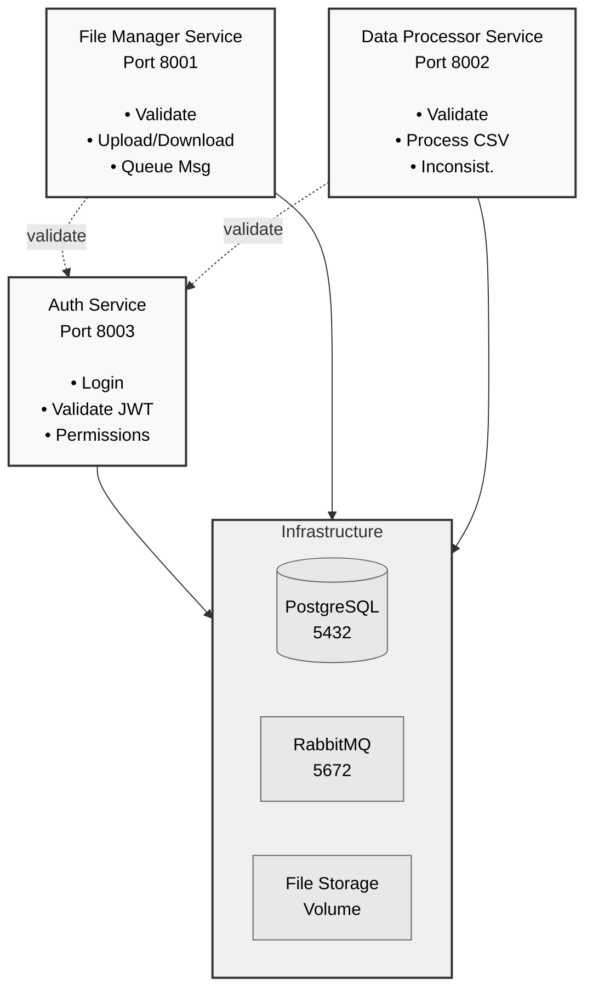
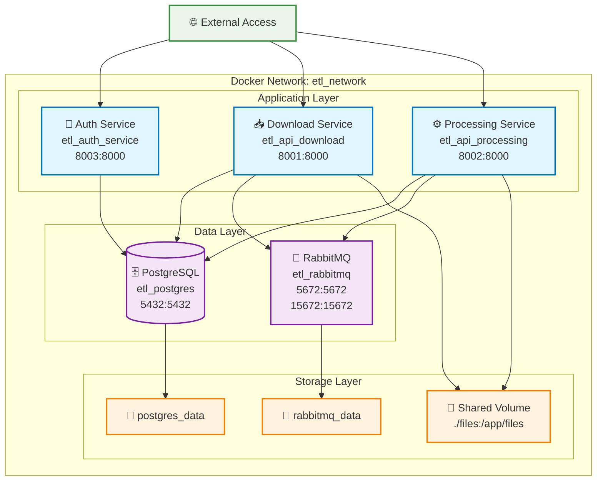
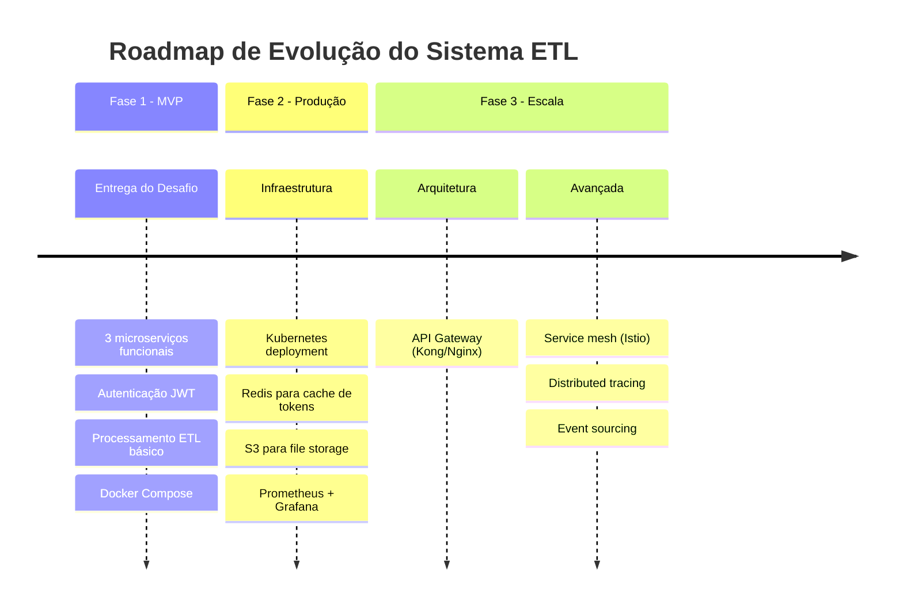

# Arquitetura do Sistema ETL - Desafio Técnico Serasa

## 📋 Visão Geral

Sistema distribuído para processamento ETL com autenticação centralizada, processamento assíncrono e escalabilidade horizontal. Composto por 3 microserviços independentes que operam em conjunto para realizar o fluxo completo de download, autenticação e processamento de arquivos CSV.

## 🏗️ Arquitetura Geral



## 🔧 Stack Tecnológica por Serviço

### 🔐 **Auth Service (Microserviço de Autenticação)**

**Porta:** `8003`

| Componente | Tecnologia | Justificativa |
|------------|------------|---------------|
| **Framework** | FastAPI | Performance superior, async nativo, OpenAPI automático |
| **Autenticação** | JWT (José) | Stateless, escalável, padrão da indústria |
| **Validação** | Pydantic | Type safety, validação automática de dados |
| **HTTP Client** | httpx | Async HTTP client para comunicação inter-serviços |
| **Logs** | structlog | Logs estruturados para observabilidade |

**Dependências Principais:**
```python
fastapi==0.104.1
python-jose[cryptography]==3.3.0
pydantic==2.5.0
structlog==23.2.0
```

**Responsabilidades:**
- Autenticação via login/senha
- Geração e validação de tokens JWT
- Controle de permissões granulares
- Endpoint de health check

---

### 📥 **Download Service (Microserviço de Download)**

**Porta:** `8001`

| Componente | Tecnologia | Justificativa |
|------------|------------|---------------|
| **Framework** | FastAPI | Async file handling, performance para I/O |
| **Upload/Download** | python-multipart + aiofiles | Async file operations, memory efficient |
| **Queue Client** | aio-pika | Async RabbitMQ client, robust error handling |
| **File Storage** | Local + aiofiles | Simplicidade para o desafio, facilmente migrável para S3 |
| **Validation** | Pydantic | Validação de metadados e payloads |
| **Auth Client** | httpx | Comunicação com Auth Service |

**Dependências Principais:**
```python
fastapi==0.104.1
aiofiles==23.2.0
python-multipart==0.0.6
aio-pika==9.3.1
httpx==0.25.2
pydantic==2.5.0
```

**Responsabilidades:**
- Upload de arquivos CSV
- Validação de permissões via Auth Service
- Download controlado de arquivos
- Envio de metadados para fila RabbitMQ
- Logs estruturados de acessos

---

### ⚙️ **Processing Service (Microserviço de Processamento)**

**Porta:** `8002`

| Componente | Tecnologia | Justificativa |
|------------|------------|---------------|
| **Framework** | FastAPI | Async processing, background tasks |
| **Queue Consumer** | aio-pika | Async RabbitMQ consumer com retry strategy |
| **Database ORM** | SQLAlchemy + asyncpg | Async PostgreSQL ORM, performance superior |
| **CSV Processing** | pandas + aiofiles | Powerful data manipulation, async file reading |
| **Data Validation** | Pydantic + pandera | Type validation + data schema validation |
| **Encryption** | cryptography | Reversible encryption para dados sensíveis (bônus) |
| **Background Tasks** | FastAPI BackgroundTasks | Async processing sem bloquear responses |

**Dependências Principais:**
```python
fastapi==0.104.1
sqlalchemy[asyncio]==2.0.23
asyncpg==0.29.0
pandas==2.1.3
aio-pika==9.3.1
pandera==0.17.2
cryptography==41.0.8
aiofiles==23.2.0
```

**Responsabilidades:**
- Consumer da fila RabbitMQ (background worker)
- Processamento e validação de arquivos CSV
- Transformações ETL (normalização, deduplicação)
- Persistência no PostgreSQL
- Registro de inconsistências
- Criptografia de dados sensíveis
- Endpoint manual de processamento

---

## 🗄️ **Infraestrutura**

### **PostgreSQL Database**
**Porta:** `5432`

| Componente | Tecnologia | Justificativa |
|------------|------------|---------------|
| **Database** | PostgreSQL 15 | JSONB nativo, extensões crypto, ACID completo |
| **Schema** | Migrations via Alembic | Versionamento de schema, deploy controlado |

**Estrutura de Dados:**
```sql
-- Usuários processados
CREATE TABLE users (
    id SERIAL PRIMARY KEY,
    encrypted_data JSONB,      -- Dados criptografados
    file_id VARCHAR(255),
    processed_at TIMESTAMP DEFAULT NOW()
);

-- Inconsistências encontradas
CREATE TABLE file_inconsistencies (
    id SERIAL PRIMARY KEY,
    file_id VARCHAR(255),
    line_number INTEGER,
    field_name VARCHAR(100),
    invalid_value TEXT,
    error_message TEXT,
    details JSONB,
    created_at TIMESTAMP DEFAULT NOW()
);

-- Log de processamentos
CREATE TABLE file_processing_log (
    id SERIAL PRIMARY KEY,
    file_id VARCHAR(255),
    status VARCHAR(50),
    records_processed INTEGER,
    records_invalid INTEGER,
    started_at TIMESTAMP,
    finished_at TIMESTAMP,
    error_details JSONB
);
```

### **RabbitMQ Message Broker**
**Porta:** `5672` (AMQP) | `15672` (Management UI)

| Componente | Tecnologia | Justificativa |
|------------|------------|---------------|
| **Message Broker** | RabbitMQ 3-management | FIFO garantido, Dead Letter Queue, UI para debug |
| **Retry Strategy** | Dead Letter Exchange | Exponential backoff, máximo de tentativas |

**Configuração de Filas:**
```yaml
Exchanges:
  - main: Fila principal de processamento
  - retry: Fila de retry com TTL
  - dlx: Dead Letter Exchange para falhas definitivas

Queues:
  - file_processing: Fila principal (FIFO)
  - file_processing_retry: Retry com delay de 30s
  - file_processing_failed: Falhas definitivas
```

### **File Storage**
**Tipo:** Volume Docker compartilhado

| Componente | Tecnologia | Justificativa |
|------------|------------|---------------|
| **Storage** | Docker Volume | Simplicidade, compartilhamento entre containers |
| **Estrutura** | `/files/{original,processed,failed}` | Organização por status de processamento |

---

## 🚀 **Estratégias de Escalabilidade**

### **Horizontal Scaling**

| Serviço | Estratégia | Load Balancer |
|---------|------------|---------------|
| **Auth Service** | Stateless, múltiplas instâncias | Nginx/HAProxy |
| **Download Service** | Stateless, shared file storage | Nginx + sticky sessions |
| **Processing Service** | Multiple consumers na mesma fila | RabbitMQ auto-balance |

### **Configuração Docker Compose para Escala**
```bash
# Escalar serviços independentemente
docker-compose up --scale api-download=3 --scale api-processing=2
```

---

## 📊 **Observabilidade e Logs**

### **Logging Strategy**

| Componente | Formato | Destino |
|------------|---------|---------|
| **Application Logs** | JSON estruturado | stdout → container logs |
| **Access Logs** | Combined format | stdout |
| **Error Tracking** | Structured with stack traces | stderr |

### **Métricas e Monitoramento**

| Métrica | Descrição | Serviço |
|---------|-----------|---------|
| **Response Time** | Latência de endpoints | Todos |
| **Queue Depth** | Mensagens pendentes | Processing |
| **Error Rate** | Taxa de falhas | Todos |
| **File Process Rate** | Arquivos/minuto | Processing |

---

## 🔒 **Segurança**

### **Estratégias Implementadas**

| Aspecto | Implementação | Serviço |
|---------|---------------|---------|
| **Autenticação** | JWT com expiração | Auth Service |
| **Autorização** | Permission-based access | Download/Processing |
| **Dados Sensíveis** | AES-256 encryption | Processing |
| **Network** | Internal Docker network | Todos |
| **CORS** | Configured origins | Todos |

### **Fluxo de Segurança**
```
1. User login → Auth Service generates JWT
2. Client requests → Validates JWT with Auth Service  
3. Permission check → Granular permissions per endpoint
4. Data encryption → Sensitive fields encrypted before DB storage
```

---

## 🧪 **Estratégia de Testes**

### **Tipos de Teste por Serviço**

| Serviço | Unit Tests | Integration Tests | E2E Tests |
|---------|------------|-------------------|-----------|
| **Auth** | JWT generation/validation | Database operations | Login flow |
| **Download** | File validation | RabbitMQ publish | Full download flow |
| **Processing** | CSV parsing/validation | Database + Queue | End-to-end ETL |

---

## 📦 **Deploy e DevOps**

## 📦 **Deploy e DevOps**

### **Estrutura de Containers**



### **Orquestração**
```yaml
# docker-compose.yml com todos os serviços
version: '3.8'
services:
  auth-service: # Port 8003
  download-service: # Port 8001  
  processing-service: # Port 8002
  postgres: # Port 5432
  rabbitmq: # Ports 5672, 15672
```

---

## 🎯 **Justificativas das Escolhas**

### **Por que FastAPI para todos os serviços?**
- **Performance**: ~3x mais rápido que Django para I/O intensivo
- **Async nativo**: Ideal para operações de arquivo e rede
- **OpenAPI automático**: Documentação gerada automaticamente
- **Type safety**: Pydantic integrado para validação
- **Microserviços**: Lightweight, ideal para containers

### **Por que RabbitMQ?**
- **FIFO garantido**: Requisito explícito do desafio
- **Dead Letter Queue**: Estratégia robusta de retry
- **Management UI**: Debug e monitoramento facilitados
- **Durabilidade**: Mensagens persistem em falhas

### **Por que PostgreSQL?**
- **Sugerido no desafio**: Atende especificação
- **JSONB**: Ideal para inconsistências estruturadas
- **Extensions**: pg_crypto para criptografia
- **ACID**: Integridade para dados ETL

---

### **Roadmap de Melhorias**



---

## 🏃‍♂️ **Como Executar**

```bash
# 1. Clone o repositório
git clone <repo-url>
cd etl-desafio-serasa

# 2. Subir infraestrutura
docker-compose up -d

# 3. Verificar serviços
curl http://localhost:8003/health  # Auth Service
curl http://localhost:8001/health  # File Manager Service  
curl http://localhost:8002/health  # Data Processor Service

# 4. Acessar documentação
open http://localhost:8001/docs     # Swagger File Manager API
open http://localhost:8002/docs     # Swagger Data Processor API
open http://localhost:15672         # RabbitMQ Management
```

---

**Arquitetura projetada para demonstrar conhecimento em microserviços, processamento assíncrono, segurança e escalabilidade horizontal conforme requisitos do desafio técnico.**